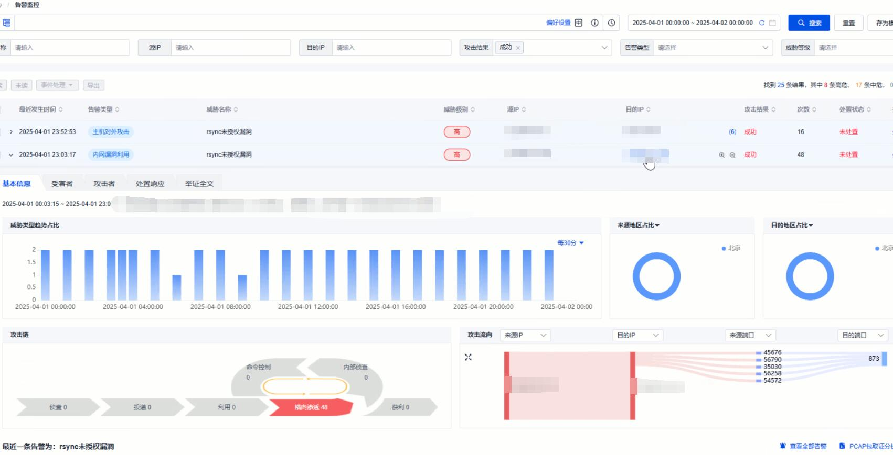
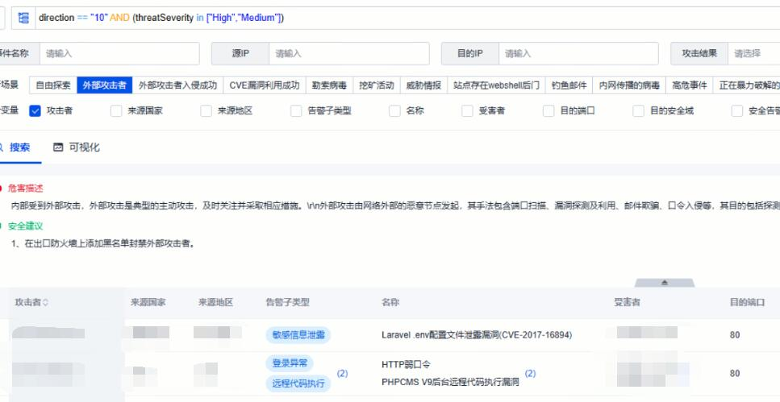
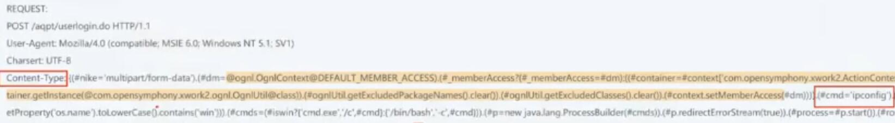

# SOC Playbook: Attack Investigation

## 1. Objective 
- Identify, investigate, and respond to potential attacks detected by SIEM alerts, ensuring timely mitigation and accurate classification of incidents.
- Investigate **high-severity alerts** first (command injection, file upload).  
- Use queries to prioritize alerts with **high-frequency IPs**.  

 
---

## 2. Detection
- Alerts triggered in SIEM (e.g., SQL injection, command injection, brute-force login, webshell).  
- Indicators include suspicious keywords, abnormal file access attempts, repeated login failures, or payload-like patterns.  

---

## 3.Analyze the attack
### Step 1 – Identify flase positives
- Check if the request contains:  
  - **Accessing what should not be accessed** (e.g., `/etc/passwd`,bak,conf files).  
  - **Containing what should not appear** (e.g., malicious SQL commands, encoded payloads).
  - If one of them are ture, go Step 2, otherwise close the alert as false positive.
    

### Step 2 – Analyze whether the attack is successful
- Check if:
 - **There is a response**(code 200,300,even 500).
- If yes,check
 - **Response of the attack query**(any reply to the attack is dangrous,e.g.,ipconfig,whoami,select top1 password from ...).
 - Go step 3
- If no,then it likely got filtered by firewall/IPS(if necessary,check the pacap file for futher analyze.)
- After confirming from the firewall interruption history, close the alert.

### Step 3 – Threat Hunting
- For Successful attacks:
- **Report** → Report the attack to IR team at once.  
- **Attack method** → identify the attack method.  
- **Find the source** → Where does this attack come from.  
- **Impact** → What has been impacted by this attack(user,machine,file..).

If unclear, export **pcap** for full traffic analysis (data leakage, payload execution, file transfer).  

---

## 4. Response
- **False positive** → document and close ticket.  
- **True attack, unsuccessful** → block source IP and close incident.  
- **True attack, successful** →  
  - Escalate to Incident Response (IR) team.  
  - Create incident report (timeline, IoCs, affected systems).
  - Do [Step 3](#step-3--threat-hunting). 
  - Notify stakeholders.  
---

## 6. Example Cases
- **SQL Injection Attempt**:  
  - Detected `UNION SELECT` in request.  
  - Response showed no DB reply → blocked IP → closed as unsuccessful.  

- **Brute Force Login**:  
  - Multiple weak password attempts from one IP.  
  - Action → blocked IP, generated ticket.  

- **Path Traversal**:  
  - Request contained `../` to restricted directories.  
  - Attempt failed → blocked IP, documented case.  
