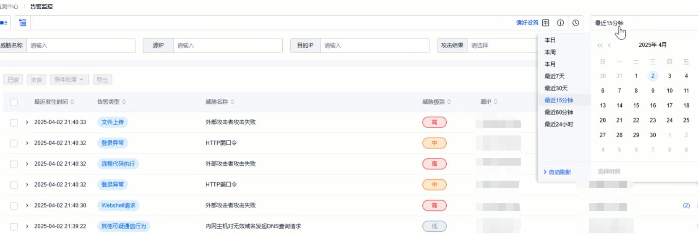

# SOC Playbook: Attack Investigation

## 1. Objective
Identify, investigate, and respond to potential attacks detected by SIEM alerts, ensuring timely mitigation and accurate classification of incidents.

---

## 2. Detection
- Alerts triggered in SIEM (e.g., SQL injection, command injection, brute-force login, webshell).  
- Indicators include suspicious keywords, abnormal file access attempts, repeated login failures, or payload-like patterns.  

---

## 3.Identify False Positives
### Step 1 – First glance
- Check if the request contains:  
  - **Accessing what should not be accessed** (e.g., `/etc/passwd`,bak,conf files).  
  - **Containing what should not appear** (e.g., malicious SQL commands, encoded payloads).
  - If one of them are ture, go Step 2, otherwise close the alert as false positive.

### Step 2 – Analyze whether the attack is successful
- Check if:
- **There is a response**(code 200,300,even 500).
- If yes,check
- **Response of the attack query**(any reply to the attack is dangrous,e.g.,ipconfig,whoami,select top1 password from ...).
- 

### Step 3 – Confirm True Positives
- **SQL injection** → look for SQL errors or DB response.  
- **Command injection** → identify obfuscated commands (e.g., `invoke`, base64, IP addresses).  
- **Brute-force login** → repeated failed attempts from same IP.  
- **Path traversal** → abnormal file access with `../`.  

If unclear, export **pcap** for full traffic analysis (data leakage, payload execution, file transfer).  

---

## 4. Response
- **False positive** → document and close ticket.  
- **True attack, unsuccessful** → block source IP and close incident.  
- **True attack, successful** →  
  - Escalate to Incident Response (IR) team.  
  - Create incident report (timeline, IoCs, affected systems).  
  - Notify stakeholders.  

---

## 5. Prioritization
- Investigate **high-severity alerts** first (command injection, file upload).  
- Prioritize alerts with **high-frequency IPs**.  

---

## 6. Example Cases
- **SQL Injection Attempt**:  
  - Detected `UNION SELECT` in request.  
  - Response showed no DB reply → blocked IP → closed as unsuccessful.  

- **Brute Force Login**:  
  - Multiple weak password attempts from one IP.  
  - Action → blocked IP, generated ticket.  

- **Path Traversal**:  
  - Request contained `../` to restricted directories.  
  - Attempt failed → blocked IP, documented case.  
