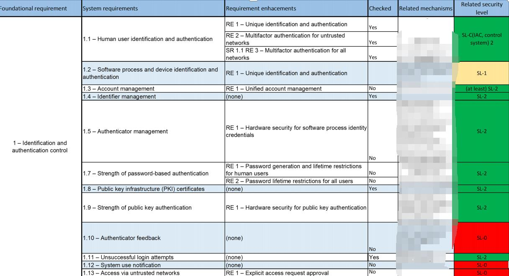
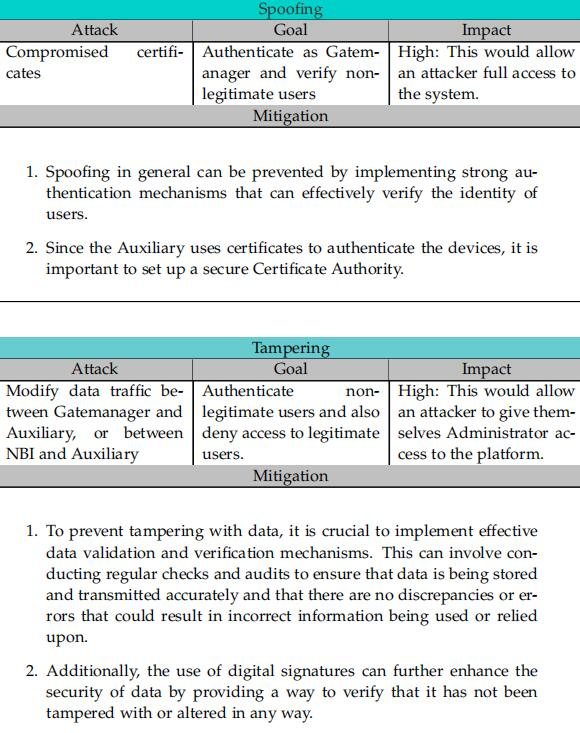
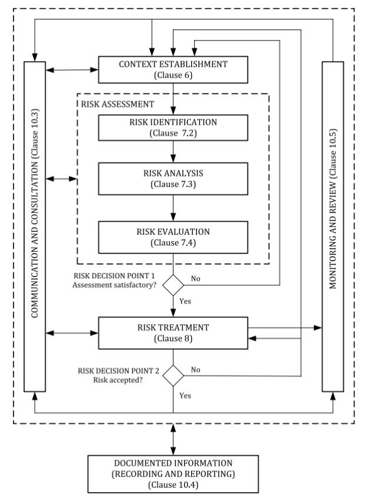

# Risk Management Playbook

## 1. Objective
Provide a structured approach for identifying, analyzing, evaluating, and managing risks related to information assets.  

Ensure risks are properly documented, assessed, and either mitigated or accepted based on organizational risk appetite.

Perform gap analysis, to analyze the target security level.

---

 For a detailed risk analysis case, see [SQL Injection Risk Case](../Risk case.md).

## 2. Risk Identification
- **Asset Classification**  
  - Identify critical assets (systems, data, services).  
  - Assign value based on **CIA triad** (Confidentiality, Integrity, Availability).  
    - High confidentiality data (e.g., customer PII).  
    - High integrity assets (e.g., financial systems).  
    - High availability services (e.g., online portals).  

- **Threat Identification**  
  - Use **frameworks like STRIDE** (Spoofing, Tampering, Repudiation, Information Disclosure, Denial of Service, Elevation of Privilege).  
  - Map potential risks to assets.
 
    
 

- **Control Review**  
  - Identify existing technical/organizational controls (e.g., firewalls, backups, access controls).  
  - Estimate **protection level** (low, medium, high).  

---

## 3. Risk Analysis
- **Risk Formula**  
- **Asset (1–5)**: value based on CIA.
- **Likelihood (1–5)**: Rare(1) … Likely(5).
- **Impact (1–5)**: Minor(1) … Critical(5).
- **Control Effectiveness (0–1)**: how much existing controls reduce risk.
  - 0.0 = no effective controls; 0.6 = controls reduce 60% of the risk.

**Example** (Customer DB):
- Asset = 5  
- Likelihood = 4  
- Impact = 5  
- Control Effectiveness = 0.6  
- **Risk Score = 5 × 4 × 5 × (1 − 0.6) = 40**

- **Thresholds**  
- **0–20** → Low (acceptable; monitor)  
- **21–40** → Medium (mitigate if feasible)  
- **41–75** → High (not acceptable → treat)  
- **>75** → Critical (immediate action)

---

## 4. Risk Evaluation
- Compare calculated risk scores against **risk appetite & tolerance levels**.  
- Decision points:  
- **Acceptable Risk** → Document, monitor periodically.  
- **Unacceptable Risk** → Escalate for treatment.  

**Evaluation matrix**

| Risk Score | Category | Decision |
|:----------:|:--------:|:---------|
| 0–20       | Low      | Accept / Monitor |
| 21–40      | Medium   | Mitigate if feasible |
| 41–75      | High     | Not acceptable → Treat |
| >75        | Critical | Immediate action |

---

## 5. Risk Treatment
- For unacceptable risks, determine strategy:  
- **Mitigate** → Implement additional controls (patching, network segmentation, MFA).  
- **Transfer** → Insurance, outsourcing.  
- **Avoid** → Stop risky process or service.  
- **Accept** → With management approval, document justification.  

---

## 6. Monitoring & Review
- Regularly update asset inventory, threats, and control effectiveness.  
- Re-assess risks when:  
- New systems are introduced.  
- Major security incidents occur.  
- Regulations change.  

